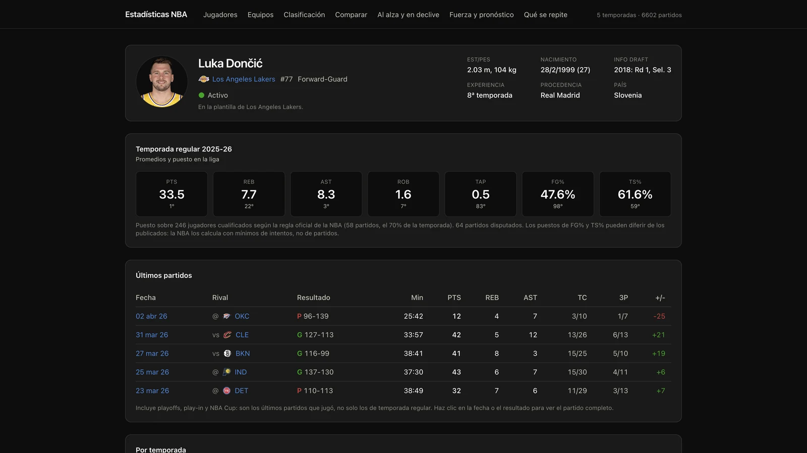

# NBA Stats

Plataforma full-stack de analítica NBA: ingesta de datos, PostgreSQL, análisis
estadístico, pronóstico de partidos y una aplicación web en React/TypeScript.
No es un notebook ni un visor de estadísticas — es un sistema completo que va
de la fuente a la pantalla y que mide cuánta confianza merece cada número.

[](https://github.com/RichartVT/nbastats/actions/workflows/ci.yml)
[](LICENSE)

| | |
|---|---|
| **5 temporadas · 6.602 partidos** | de 2021-22 a 2025-26, temporada regular, play-in y playoffs |
| **3,25 M+ eventos play-by-play** | el detalle jugada a jugada, no solo el box score |
| **65,8 % de acierto** | pronóstico evaluado sobre 4.906 partidos fuera de muestra |
| **534 tests automatizados** | backend y frontend verificados por separado en CI |



## Qué hace

- **Explorar** jugadores, equipos y partidos: fichas, plantillas, clasificación,
  historial y box scores hasta el nivel de cuarto.
- **Analizar tendencias**: quién está en declive y quién al alza, y en qué
  situaciones rinde distinto cada jugador (descanso, localía, rival, día).
- **Distinguir habilidad de ruido**: cuántos partidos hacen falta para que un
  dato signifique algo, y cuáles se repiten entre temporadas.
- **Pronosticar partidos**: probabilidad de victoria con ratings ajustados por
  rival, validada con backtesting.

## Por qué este proyecto es diferente

Calcular un número es la parte fácil. Lo que este sistema intenta hacer, y lo
que le da forma, es **saber cuándo ese número aguanta y cuándo no**:

- Los splits no se publican como un promedio suelto, sino con su **intervalo**
  y con corrección por comparaciones múltiples: mirar veinte cortes y quedarse
  con el más llamativo produce hallazgos falsos, y eso se controla.
- El **tamaño de muestra** decide qué se muestra. Con pocos partidos, la
  interfaz lo dice en vez de enseñar un porcentaje que no significa nada.
- El pronóstico se evalúa **fuera de muestra** y se juzga tanto por su acierto
  como por su **calibración**: que cuando dice 70 %, acierte cerca del 70 %.
- Hay **protección explícita contra fugas de información**. La señal más fuerte
  que se encontró —el impacto de las ausencias— está deliberadamente fuera del
  modelo: la variable disponible en este dataset identifica quién terminó sin
  jugar, información que solo queda confirmada después del partido. Un test
  falla si alguien intenta añadirla.

Y cuando algo se probó y no funcionó, está documentado como resultado negativo
en vez de desaparecer del historial.


> `k` estima cuántos partidos necesita una métrica para separar señal de ruido:
> ~3 para el volumen de triples propios y ~150 para el porcentaje de triples
> permitido al rival.

## Pronóstico de partidos

Modelo de probabilidad de victoria con ratings de equipo ajustados por rival,
entrenado solo con temporadas anteriores y evaluado con backtesting
walk-forward sobre **4.906 partidos fuera de muestra**.

| Métrica | Modelo | Siempre gana el local | Gana el de mejor récord |
|---|---|---|---|
| Acierto | **65,76 %** | 55,56 % | 64,64 % |
| Brier score | **0,2133** | 0,248 | — |
| Log-loss | **0,6147** | 0,689 | — |
| Brier Skill Score | **0,1362** | 0 | — |

La calibración importa tanto como el acierto. Agrupando los partidos por la
confianza que el modelo expresó:

| El modelo dice | Partidos | Acierto observado |
|---|---|---|
| 50-55 % | 1.044 | 52,4 % |
| 55-65 % | 1.675 | 60,1 % |
| 65-75 % | 1.280 | 72,4 % |
| 75 % o más | 907 | 82,2 % |

**En estos tramos, una mayor confianza del modelo se corresponde de forma
consistente con un mayor acierto observado.** Por eso la evaluación no se limita
al porcentaje de aciertos: una probabilidad solo sirve para algo más que ordenar
partidos si además se puede contrastar con la frecuencia observada.


> El simulador publica por separado las dos rutas del modelo —logística y margen—
> para poder ver si discrepan.

Dos apuntes de contexto, medidos y no supuestos:

- **El baloncesto es muy variable.** La desviación del margen por partido ronda
  los 13,8 puntos, frente a un margen esperado medio de 5,3. Buena parte del
  resultado de un partido concreto no es previsible con esta información.
- **Más datos rinden cada vez menos.** Entrenando con 1, 2, 3 y 4 temporadas
  previas, el acierto se mueve entre 65,56 % y 65,78 %: multiplicar por 2,4 los
  datos de entrenamiento cambia el resultado en +0,18 puntos porcentuales. La
  curva de aprendizaje sugiere que, en el rango probado, añadir más historia
  aporta poco; las mejoras probablemente dependan más de mejores variables o de
  cambios en el modelado.

El detalle completo, con los intervalos y las pruebas de significación, está en
[`CONCLUSIONES.md`](CONCLUSIONES.md).

## Características técnicas

- **Ingesta idempotente y reanudable.** Una pasada interrumpida a las dos horas
  se retoma donde se quedó; la tabla de destino es el registro de lo hecho, sin
  tabla de checkpoint.
- **PostgreSQL con vistas materializadas.** Las consultas analíticas van contra
  vistas precalculadas, no contra las tablas de hechos, con las dimensiones de
  corte ya resueltas.
- **Análisis estadístico separado del almacenamiento.** El paquete `analysis/`
  no importa SQLAlchemy ni conoce la base: recibe listas de números y devuelve
  objetos, lo que permite probarlo contra mundos sintéticos donde la verdad se
  conoce de antemano.
- **Detección de tendencias** por Mann-Kendall combinado con regresión, más
  detección de puntos de cambio para distinguir un declive gradual de un
  escalón.
- **API con FastAPI** cuyos esquemas Pydantic son el origen de los tipos del
  frontend, de modo que un cambio de contrato rompe la compilación en vez de
  fallar en tiempo de ejecución.
- **Interfaz en React + TypeScript** donde los menús se construyen desde el
  catálogo que expone la API, no desde constantes duplicadas en el cliente.

## Arquitectura

```
NBA (stats.nba.com)
      |  ingesta idempotente y reanudable
      v
PostgreSQL  -->  columnas derivadas  -->  vistas materializadas
      |            (derive.sql)              (views.sql)
      v
analysis/   puro: recibe listas de números, no sabe que hay una base
      |
      v
api/        FastAPI: lee filas, llama a analysis, devuelve JSON
      |
      v
web/        React + TypeScript
```

La regla que sostiene el resto: `analysis/` no conoce la base de datos. Por eso
cada motor estadístico se puede probar de forma aislada.

## Stack

| Capa | Tecnologías |
|---|---|
| Datos y backend | Python 3.12, FastAPI, PostgreSQL 17, SQLAlchemy 2.0, Alembic |
| Analítica | NumPy, SciPy, statsmodels, PyMannKendall, ruptures |
| Frontend | React 19, TypeScript, TanStack Query, React Router, Recharts |
| Ingeniería | Docker, pytest, Ruff, GitHub Actions, uv |

## Calidad y pruebas

**534 tests automatizados**, con integración continua real en GitHub Actions:
dos jobs independientes que verifican backend y frontend por separado, de forma
que un fallo dice qué mitad se rompió.

| Entorno | Resultado |
|---|---|
| Local, con el dataset cargado | 534 pasan |
| CI, sin PostgreSQL | **524 pasan y 10 se saltan** |

Los 10 que se saltan son los que consultan las vistas materializadas sobre el
dataset ingerido, que CI no puede tener: la ingesta lleva horas y
`stats.nba.com` rechaza las IP de centro de datos. El salto es limpio y
explícito, y la suite completa sigue tardando 2 segundos.

Lo que se prueba, más allá de la cobertura:

- **Mundos sintéticos donde la verdad se conoce.** Se genera una serie con una
  tendencia conocida y se comprueba que el motor la recupera — así se descubrió
  que el método delta corrige el sesgo de supervivencia en la curva de edad.
- **Verificación cruzada Python ↔ SQL.** Las mismas fórmulas están escritas dos
  veces, en `analysis/rates.py` y en las vistas materializadas. En vez de borrar
  una, se comprueba que coinciden, con tolerancias que son el redondeo del tipo
  de la columna y no un margen elegido hasta que el test pasara.
- **Protección contra fugas de información.** Un test falla si las ausencias
  entran en las variables del modelo: la variable disponible en este dataset
  identifica quién terminó sin jugar, y eso solo queda confirmado después del
  partido.

## Puesta en marcha

<details>
<summary>Ejecutar localmente</summary>

### Requisitos

- Docker (para PostgreSQL 17)
- [`uv`](https://docs.astral.sh/uv/) (gestiona Python 3.12 y las dependencias)

### Arranque

```bash
cp .env.example .env       # los valores por defecto ya sirven
docker compose up -d       # PostgreSQL en localhost:5433
uv sync
uv run alembic upgrade head
uv run pytest
```

El puerto es el **5433**, no el 5432, para no chocar con el `postgresql@14` de
Homebrew.

Para entrar a la base:

```bash
docker exec -it nbastats-db psql -U nbastats -d nbastats
```

### Cargar los datos

```bash
uv run nbastats ingest-seasons    # box scores, 5 temporadas (~3 min)
uv run nbastats enrich            # hora de inicio y sedes neutrales (~10 min)
uv run nbastats ingest-bios       # ficha de jugador: nacimiento, dorsal... (~12 min)
uv run nbastats ingest-teams      # fichas, plantillas y clasificación (~3 min)
uv run nbastats refresh           # columnas derivadas y vistas
uv run nbastats status            # ver qué hay cargado
```

Después, `uv run nbastats daily` mantiene todo al día en un solo comando.

> **La ingesta debe correr desde una máquina doméstica.** `stats.nba.com` está
> detrás de protección Akamai y descarta conexiones desde IP de centro de datos
> (AWS, GCP, Azure) sin devolver error: la petición se queda colgada hasta el
> timeout. El backend sí se puede desplegar a la nube; la ingesta no.

### Levantar la aplicación

Dos procesos, en dos terminales:

```bash
uv run uvicorn nbastats.api.main:app --reload    # API en :8000, /docs incluido
cd web && npm install && npm run dev             # interfaz en :5173
```

El frontend habla con la API por un proxy de Vite, así que usa rutas relativas
y no hay que configurar CORS en desarrollo.

</details>

## Documentación técnica

| Documento | Para qué |
|---|---|
| [`CONCLUSIONES.md`](CONCLUSIONES.md) | **Empieza aquí para ver resultados.** Qué sabe hacer el sistema con la cifra al lado, y qué haría falta para mejorarlo |
| [`COMO_FUNCIONA.md`](COMO_FUNCIONA.md) | Arquitectura y metodología: el recorrido de un dato de la NBA a la pantalla, y cómo se calcula un pronóstico paso a paso |
| [`CAPABILITIES.md`](CAPABILITIES.md) | Qué preguntas puede contestar el sistema y cuáles devuelven un número que no significa nada |
| [`BITACORA.md`](BITACORA.md) | Registro de desarrollo, con las decisiones y los resultados negativos incluidos |

## Límites y metodología

Este proyecto distingue dos cosas que es fácil confundir: **que un número se
pueda calcular** y **que haya evidencia suficiente para afirmarlo**. Los
resultados negativos no son defectos, son el mecanismo que separa una de otra.

**Lo que se probó y no funcionó**, documentado con su medición en
[`CONCLUSIONES.md`](CONCLUSIONES.md): un modelo de «debió ganar» a partir de
métricas avanzadas; predecir una temporada entera desde junio; y normalizar la
calidad de tiro desde el play-by-play, que perdió contra la línea base en los
cuatro cortes probados.

**Límites de los datos.** Fuente única: `nba_api` (stats.nba.com). El dataset de
Kaggle `wyattowalsh/basketball` se descartó tras comprobarlo: no contiene box
scores de jugador. La ingesta debe correr desde una máquina doméstica por el
bloqueo de Akamai descrito arriba. Los datos son de uso personal y educativo, y
este repositorio no los redistribuye.

**Tres detalles del esquema que no son arbitrarios:**

1. **`game_id` es texto.** Los ids de la NBA llevan ceros a la izquierda
   (`"0022300001"`). Pasarlos por `int` desplaza el código y un partido de
   temporada regular pasa a leerse como All-Star. Hay un test que lo comprueba.
2. **`game_date_local`, no UTC.** Un partido que empieza el viernes a las 22:30
   en Nueva York son las 03:30 del sábado en UTC. Derivar el día de la semana
   desde UTC movería de día los partidos nocturnos y sesgaría todos los splits.
3. **Los minutos se guardan en segundos.** La fuente los da como `"34:12"` y a
   veces como `"34.000000:12"`. Se normalizan una sola vez, en la ingesta.

## Licencia

El **código** está bajo licencia [MIT](LICENSE).

Los **datos** no. Provienen de `stats.nba.com`, no están cubiertos por la
licencia MIT y este repositorio no los redistribuye: no hay ni un box score
versionado aquí. Para tener datos hay que descargarlos con los comandos de
ingesta, y ese uso es personal y educativo.
